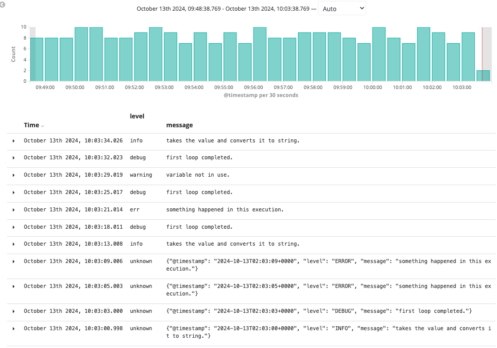

# How to parse json logs in 4.6

If you check the official document of openshift, there is no json format parsing supported until 4.7, before 4.6, we can manually set the env "MERGE_JSON_LOG" to be "true" with unmanaged logging operator to force fluentd to parse json format. However the same does not apply to 4.6, as the env is not referenced any more in the fluentd config, if you dump the config of fluentd, you could find it

Below in 4.6
```
[lab-user@bastion-d46r9 tmp]$ oc get cm -n openshift-logging fluentd -o jsonpath='{.data.fluent\.conf}' | grep MERGE_JSON_LOG
[lab-user@bastion-d46r9 tmp]$
```

So it is similar that we can also manually force the fluentd to parse json log, but be awared that it is not a supported way to do so, no mention that OCP4.6 is not ago EOLed release

## How to enforce it to parse json?

1. Set the operator to be unmanaged
```
[lab-user@bastion-d46r9 tmp]$ oc get cl -n openshift-logging
NAME       MANAGEMENT STATE
instance   Unmanaged
```

2. Update the fluentd configmap
```
[lab-user@bastion-d46r9 tmp]$ oc get cm -n openshift-logging fluentd -o jsonpath='{.data.fluent\.conf}' | grep merge_json_log
    merge_json_log 'true'
    merge_json_log 'true'
    merge_json_log true
```
3. Restart all the fluentd pods

After applying above steps, you should be able to see json parsed logs in kibana

